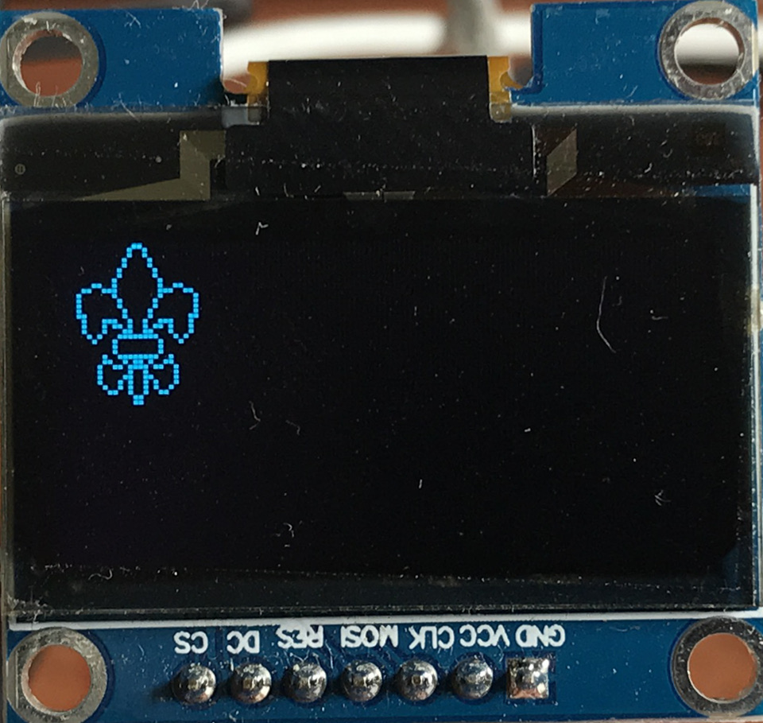

# Custom bitmaps for OLED displays driven by Arduino

Or my experiments in creating bitmaps for OLED displays driven by Arduino. But
I am hoping this becomes image to bitmap for OLED displays.

## Manual process

1. find an image, a fluer-de-lis from the Polish scouting site
  - via [https://www.pangea.gliwice.zhp.pl](https://www.pangea.gliwice.zhp.pl/index.php/poradnik-harcerski-symbolika-harcerska/poradnik-harcerski-symbolika-lilijka-harcerski)
  - [png harcerska lilijka (scouting fleur-de-lis)](https://www.pangea.gliwice.zhp.pl/images/5-Podstrony/4-StrefaHarcerza/6-Poradnik/2-Symbolika/PoradnikHarcerski-Symbolika-LilijkaHarcerska-1.png)
   
1. change the image size to 32x32 pixels ie 32x32 bits in Gimp and individually
   draw the required outline bit by bit basing it on the original image to come
   up with this
   
1. invert it as white becomes lit on the display
   
1. initially I planned to manually convert the image bits to code but found
   this too tedious and error prone. An Example below is from [u8glib wiki
   userreference#drawbitmap](https://github.com/olikraus/u8glib/wiki/userreference#drawbitmap)
   of a rook, a castle as may be used to display the chess piece.
   ```
   const uint8_t rook_bitmap[] U8G_PROGMEM = {
     B00000000 
     B01010101
     B01111111
     B00111110
     B00111110 
     B00111110
     B00111110 
     B01111111
   };
   ```
   If you squint at the above you can see the rook. This can be simplifed to
   hex numbers as so.
   ```
   const uint8_t rook_bitmap[] U8G_PROGMEM = {
     0x00, // 00000000 
     0x55, // 01010101
     0x7f, // 01111111
     0x3e, // 00111110
     0x3e, // 00111110 
     0x3e, // 00111110
     0x3e, // 00111110 
     0x7f  // 01111111
   };
   ```
   and this can be drawn to an OLED display with 
   ```
   void draw(void) {
     // at position 0,0 from top right
     // 1 byte (8bits wide)
     // 8 bytes long
     // using the array rook_bitmap
     u8g.drawBitmapP( 0, 0, 1, 8, rook_bitmap);
   }
   ```
1. At this stage I got confused at how to do something of a bigger width and
   started looking at what people did to convert more complicated images to
   bitmaps.
1. I came across
   [https://github.com/ehubin/Adafruit-GFX-Library/tree/master/Img2Code](https://github.com/ehubin/Adafruit-GFX-Library/tree/master/Img2Code)
   as a for the original
   [Adafruit-GFX-Library](https://github.com/adafruit/Adafruit-GFX-Library)
   it seems not to have the `Img2Code` program but refers you back to 
   [**ehubin**'s](https://github.com/ehubin) fork to get the utility program.
1. and the result is as follows
   ```
   const unsigned char fluer_de_lis[] PROGMEM = {
     0x0, 0x1, 0x80, 0x0,
     0x0, 0x2, 0x40, 0x0,
     0x0, 0x2, 0x40, 0x0,
     0x0, 0x4, 0x20, 0x0,
     0x0, 0x4, 0x20, 0x0,
     0x0, 0x8, 0x10, 0x0,
     0x0, 0x8, 0x10, 0x0,
     0x0, 0x10, 0x8, 0x0,
     0x1, 0x90, 0x9, 0x80,
     0x6, 0x70, 0xe, 0x60,
     0x8, 0x10, 0x8, 0x10,
     0x8, 0x8, 0x10, 0x10,
     0x8, 0x8, 0x10, 0x10,
     0x8, 0x4, 0x20, 0x10,
     0xc, 0x4, 0x20, 0x30,
     0x4, 0x72, 0x4e, 0x20,
     0x4, 0x5a, 0x5a, 0x20,
     0x4, 0x46, 0x62, 0x20,
     0x2, 0x8f, 0xf1, 0x40,
     0x1, 0x10, 0x8, 0x80,
     0x0, 0x10, 0x8, 0x0,
     0x0, 0x10, 0x8, 0x0,
     0x0, 0x4f, 0xf2, 0x0,
     0x0, 0x65, 0xa6, 0x0,
     0x0, 0x9b, 0xd9, 0x0,
     0x0, 0x82, 0x41, 0x0,
     0x0, 0x86, 0x61, 0x0,
     0x0, 0x8a, 0x51, 0x0,
     0x0, 0x4a, 0x52, 0x0,
     0x0, 0x32, 0x4c, 0x0,
     0x0, 0x1, 0x80, 0x0,
     0x0, 0x1, 0x80, 0x0
   };
   ```
1. putting this into a program to display it
   [arduino/fleur_de_lis_on_oled/fleur_de_lis_on_oled.ino](arduino/fleur_de_lis_on_oled/fleur_de_lis_on_oled.ino)
1. wiring up the arduino Duemilanove as follows
   ... TODO

1. we finally have a 32 pixel high fleur-de-lis on the OLED display in the top
   right hand corner
   

## Background

When I first bought an OLED display, a _Monochrome 1.3" 128x64 OLED graphic
display_, a Duinotech 1.3 Inch Monochrome OLED Display, [Jaycar CAT.NO:
XC3728](https://www.jaycar.com.au/duinotech-1-3-inch-monochrome-oled-display/p/XC3728)
I seemd to have no idea how to hook it up to my ESP32. After some weeks I
searched a little harder and found that there were actual instructions
consisting of a wiring diagram and some demo code [Jaycar Download Manual
pdf](https://www.jaycar.com.au/medias/sys_master/images/images/9451590287390/XC3728-manualMain.pdf)
and following these I got to write hello world using the suggested [u8glib
library](https://github.com/olikraus/u8glib). On their web page they say
development has stopped and to use the [u8g2
lib](https://github.com/olikraus/u8g2/wiki).

Beyond putting text on the screen I wanted to put some custom graphics. As I
was talking to a fellow scout, I decide I would give the [scout emblem, a fleur de
lis](https://en.wikipedia.org/wiki/Fleur-de-lis_in_Scouting), a go. After much
hackery in the image manipilation program [Gimp](https://www.gimp.org/) and
manually editing bits in an editor, I thought there must be a better way. The
image manipulation seems to be necessary but there is a program that converts a
bit map image into a bitmap useable to draw the bitmap on a display.

The program is a Java program Img2Code via
https://github.com/ehubin/Adafruit-GFX-Library/tree/master/Img2Code which seems
to be a fork of adafruit's
[Adafruit-GFX-Library](https://github.com/adafruit/Adafruit-GFX-Library).
Interestingly `Img2Code` is not in the original repo and even the original repo
mentions going to [**ehubin**'s](https://github.com/ehubin) fork for the
utility program.

I hope to play around with bringing some more logos into various size images in
this code repo. I also hope to extend the image to bitmap program to be a
simple web app that allows a user to:

1. upload an image
1. manipulate the size
1. change the image to monochrome
1. easily edit the individual bits
1. export the image for use in an Arduino sketch to drive an OLED display
1. send the image directly to an ESP32 to be displayed

